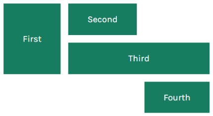
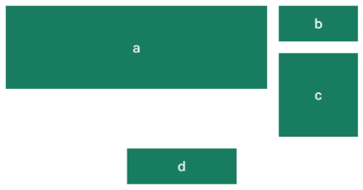
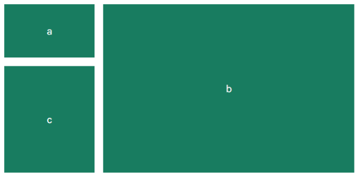
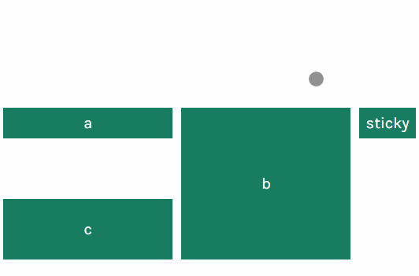
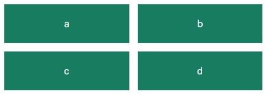
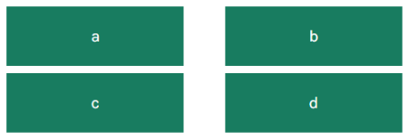

# Grid Container

> CSS Grid Layout + Custom Elements v1 + Shadow DOM v1

```html
<grid-container gutter="5vmin"
                areas="'first second .'
                       'first third third'">
  <grid-item area="first">First</grid-item>
  <grid-item area="second">Second</grid-item>
  <grid-item area="third">Third</grid-item>
  <grid-item row="first-end"
             column="second-end">
    Fourth
  </grid-item>
</grid-container>
```



## Reference

### Attributes

#### Areas

> Creates a grid template using named `grid-item`s

```html
<grid-container gutter="1rem"
                areas="
                'a a a a a a a a a b b b'
                'a a a a a a a a a c c c'
                '. . . . . . . . . c c c'
                '. . . . d d d d . . . .'
                ">
  <grid-item area="a">a</grid-item>
  <grid-item area="b">b</grid-item>
  <grid-item area="c">c</grid-item>
  <grid-item area="d">d</grid-item>
</grid-container>
```



#### Grid

> Creates a grid template using named `grid-item`s. Specifies dimensions for rows and columns

```html
<grid-container gutter="1rem"
                grid="
                  'a    b' minmax(100px, 1fr)
                  'c    b' 2fr
                / auto 70vw
                ">
  <grid-item area="a">a</grid-item>
  <grid-item area="b">b</grid-item>
  <grid-item area="c">c</grid-item>
</grid-container>
```



```html
<grid-container gutter="20vmin 2vw"
                grid="
                  'a   b   d' 1fr
                  'c   b   .' 2fr
                / 3fr 3fr 1fr
                ">
  <grid-item area="a">a</grid-item>
  <grid-item area="b">b</grid-item>
  <grid-item area="c">c</grid-item>
  <grid-item area="d"
            style="position: sticky; top: 0;">sticky</grid-item>
</grid-container>
```



```html
<grid-container gutter="16px"
                grid="auto-flow 50px / repeat(auto-fill, 300px)">
  <grid-item></grid-item>
  <grid-item></grid-item>
  <grid-item></grid-item>
  <grid-item></grid-item>
  <grid-item></grid-item>
  <grid-item></grid-item>
  <grid-item></grid-item>
</grid-container>
```


#### Gutter

> Specifies all gutters, or gutter between rows and gutter between columns separately

```html
<grid-container gutter="16px"
                areas="
                'a b'
                'c d'
                ">
  <grid-item area="a">a</grid-item>
  <grid-item area="b">b</grid-item>
  <grid-item area="c">c</grid-item>
  <grid-item area="d">d</grid-item>
</grid-container>
```



```html
<grid-container gutter="5vh 10vw"
                areas="
                'a b'
                'c d'
                ">
  <grid-item area="a">a</grid-item>
  <grid-item area="b">b</grid-item>
  <grid-item area="c">c</grid-item>
  <grid-item area="d">d</grid-item>
</grid-container>
```


